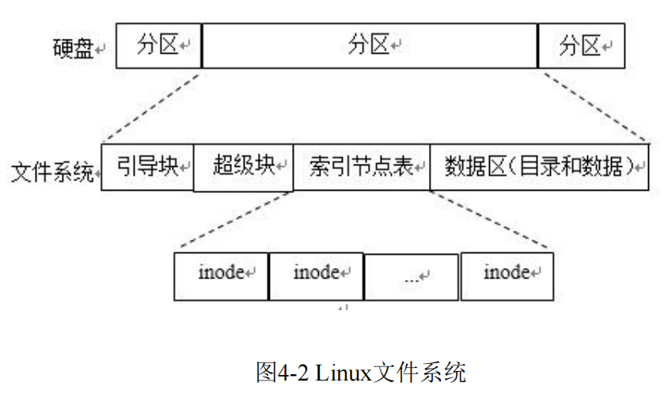

# 文件编程

Linux与win最显著的区别就是linux把所有的目录、设备都当成文件来处理。一切皆文件。

## 文件类型

文件类型：**普通文件、目录文件、链接文件、设备文件、管道文件、套接字文件**。
文件编程：**基于文件IO操作** 和 **基于流的标准IO操作**。

|文件类型标识符|类型|说明|
|---|----------|--------|
|-	|普通文件	|包括文档图片音乐等；纯文本文件(ASCII)、二进制文件(binary)、数据格式的文件(data)、各种压缩文件
|d	|目录文件	|目录，可用cd命令进入
|c	|字符设备文件	|linux驱动里面的字符设备驱动，比如 串行设备，音频设备，打印机、键盘、鼠标等
|b	|块设备文件	|存储设备驱动，比如硬盘，U盘等
|l	|链接文件	|类似Windows下面的快捷方式
|p	|管道文件	|FIFO也是一种特殊的文件类型，它主要目的是解决多个程序同时存取一个文件所造成的错误
|s	|套接字文件	|这类文件通常用在网络数据连接。可以启动一个程序来监听客户端的要求，客户端就可以通过套接字来进行数据通信

**管道**是一种特殊的文件，主要用于不同进程之间的通信。
- 无名管道：由进程在使用时创建，当读写结束关闭文件后消失。是存在于内存中的特殊文件，没有文件名称，不存在于文件系统。
- 命名管道：存在于硬盘上的文件，形式上就是文件系统中的一个文件，有文件名。
 
**套接字**：进行网络通信的特殊文件
linux可以启动一个程序来监听客户端的要求，客户端可以通过套接字来进行数据通信。
（可以通过网络连接不同计算机的进程）

##### ls -l查看目录下全部文件，同时显示权限：-:普通文件
|文件类型|用户权限|用户组权限|其他用户权限|
|-------|----------|-----------|----------|
|第0位  |第1、2、3位|第4、5、6位|第7、8、9位|
|d:目录 |  r、w、x  |  r、w、x  |  r、w、x  |
|l:链接 |读、写、执行|读、写、执行|读、写、执行|

## 文件系统的组成

文件是一个简单的字节序列。文件由一系列块（block）组成。
Linux文件系统由四部分组成：**引导块、超级块、索引节点表（inode Table）、数据区**


## 文件描述符

内核为了高效管理已被打开的文件所创建的索引，是一个非负整数（int类型），用于指代被打开的文件。
每个进程可以拥有若干个文件描述符，通常一个进程打开时会同时打开三个文件：
标准输入：文件描述符是0，对于一般进程来说是键盘；
标准输出：文件描述符是1，一般是输出到显示器；
标准错误：文件描述符是2，一般是输出到屏幕；
文件描述符 0 1 2 对应的符号常量是STDIN_FILENO、STDOUT_FILENO、STDERR_FILENO，
它们都定义在头文件<unistd.h>中（usr/include/目录下）

## 计算机架构
### 冯·诺伊曼计算机结构
工作方式：**“存储程序”**
计算机由五大部件组成：**运算器、控制器、存储器、输入设备、输出设备**。
- 存储器：存放数据和指令，计算机可以区分。
- 控制器：自动取出指令并执行。
- 运算器：能进行加减乘除四种基本运算，能进行一些逻辑运算和附加运算。
- 输入输出设备：操作人员可以通过输入输出设备和主机进行通信。
二进制表示指令和数据。每条指令由操作码和地址码组成。操作码取出操作类型，地址码取出操作数的地址。

---------------------------------------------------------------------------------------------------

## 基本文件IO操作

```c
// 创建文件
#include<sys/types.h>
#include<sys/stat.h>
#include<fcntl.h>
int creat(const char *filename,mode_t mode);
// mode：创建模式，可以用数字赋值 mode = 0777
// （1）S_IRUSR：可读==4
// （2）S_IWUSR：可写==2
// （3）S_IXUSR：可执行==1
// （4）S_IRWXU：可读、写、执行==7
// 返回值：若成功，则返回新的文件描述符；若失败，则返回-1。
```

```c
// 打开文件
#include<sys/types.h>
#include<sys/stat.h>
#include<fcntl.h>
int open(const char *pathname, int flags);
// flags：打开标志
// （1）O_RDONLY：只读方式打开
// （2）O_WRONLY：只写方式打开
// （3）O_RDWR：读写方式打开
// （4）O_APPEND：追加方式打开
// （5）O_CREAT：创建一个文件
// （6）O_NOBLOCK：非阻塞方式打开
// 如果使用了O_CREAT标志，则使用：
int open(const char *pathname,int flags,mode_t mode);
// （这里的mode只当O_CREAT时有效，mode = 0777）
// 需要指定mode表示文件的访问权限。
// 返回值：若成功，则返回文件描述符；若失败，则返回-1。
// flags：
// 必选项:以下三个常数中必须指定一个,且仅允许指定一个。
//  O_RDONLY 只读打开
//  O_WRONLY 只写打开
//  O_RDWR  可读可写打开
// --以下可选项可以同时指定0个或多个，和必选项按位或起来作为flags 参数。
//  O_APPEND 表示追加。如果文件已有内容,这次打开文件所写的数据附加到文件的末尾而不覆盖原来的内容。
//  O_CREAT 若此文件不存在则创建它。使用此选项时需提供参数mode，表示该文件的访问权限。
//  O_EXCL 如果同时指定了O_CREAT,并且文件已存在,则出错返回。
//  O_TRUNC  如果文件已存在,并且以只写或可读可写方式打开,则将其长度截断(Truncate)为0字节，即清空文本内容。
//  O_NONBLOCK 对于设备文件,以O_NONBLOCK 方式打开可以做非阻塞I/O(Nonblock I/O),非阻塞I/O在下一节详细讲解。
```

```c
// 关闭文件
#include<unistd.h>
int close(int fd);
// 参数fd为文件描述符，来自于creat或者open函数的返回值。
// 返回值：若成功，则返回0；若失败，则返回-1。
// 注：close工作步骤，先将文件描述符的数量-1，减少一个已打开的文件。
```

```c
// 读文件：
#include<unistd.h>
int read(int fd, const void *buf, size_t length)
// 从指定的文件中读取若干字节到指定的缓冲区。
// fd：文件描述符，同close函数。
// buf：指定的缓冲区指针，用于存放读取到的数据。
// length：读取的最大字节数。
// 返回值：若成功，则返回实际读取的字节数；若已到文件尾，则返回0；若出错，则返回-1。
```

```c
// 写文件：
#include<unistd.h>
int write(int fd, const void *buf, size_t length)
// 将若干字节写入到指定的文件中。
// fd：文件描述符，同close函数。
// buf：指定的缓冲区指针，用于存放待写的数据。
// length：写入的字节数。
// 返回值：若成功，则返回实际写入的字节数；若出错，则返回-1。
```

```c
// 文件定位：
#include<unistd.h>
#include<sys/types.h>
int lseek(int fd, offset_t offset, int whence)
// 将文件读写指针相对whence移动offset个字节。
// fd：文件描述符，同close函数。
// offset：偏移量，每一次操作所需要移动的字节数，可正可负。取负值，表示向前移动；取正值，表示向后移动。
// whence：当前位置的基点：
//  SEEK_SET：相对文件开头，新位置为偏移量的大小；
//  SEEK_CUR：相对文件读写指针的当前位置，新位置为当前位置加上偏移量；
//  SEEK_END：相对文件末尾，新位置为文件的大小加上偏移量大小。（可计算文件长度）
// 返回值：若成功，则返回当前的读写位置，也就是相对文件开头多少个字节；若失败，则返回-1。
```

```c
// 文件权限判断：
#include<unistd.h>
int access(const char* pathname,int mode)
// 判断文件是否可以进行某种操作（读、写等）
// pathname：文件名。
// mode：要判断的访问权限，可以取以下值或者是它们的组合：
//  R_OK：文件可读；
//  W_OK：文件可写；
//  X_OK：文件可执行；
//  F_OK：文件存在。
// 返回值：若测试成功，则返回0；否则，返回-1。
```

---------------------------------------------------------------------------------------------------

## 基于流的标准IO操作
基于流的标准I/O操作是基于C库函数、针对文件指针的操作，移植性高。

```c
// 创建和打开文件
#include<stdio.h>
FILE * fopen(const char *filename,const char *mode)
// filename：欲打开的文件名，包含路径。
// mode：打开模式，常见的打开方式有以下几种：
//    r,rb：只读；
//    w,wb：只写，如果文件不存在就创建文件；
//    a,ab：追加，如果文件不存在就创建文件；
//    r+、r+b、rb+：读写方式打开；
//    w+、w+b、wh+：读写方式打开，文件不存在则创建文件；
//    a+、a+b、ab+：读和追加方式打开，文件不存在则创建文件。
//    b表示二进制文件。
//    wt+ 读写打开或者建立一个文本文件；
//    at+ 读写打开一个文本文件，允许读或在文本末追加数据。
// 返回值：若成功，则返回指向文件指针；若失败则返回NULL，并把错误代码存在errno中。
// errno 是记录系统的最后一次错误代码。代码是一个int型的值，在linux 内核代码./usr/src/kernels/2.6.25-14.fc9.i686/include/asm-generic/errno.h中定义。
const char * input_video = "/userdata/3559.h264";
FILE * file = fopen(input_video, "rb");
```

```c
// 读文件
#include<stdio.h>
size_t fread(void *ptr,size_t size,size_t n,FILE *stream)
// 函数功能：从文件流中读取数据。
// 参数说明如下：
//  ptr：指向欲存放读取进来的数据空间，是一个字符数组。
//  size：每个字段的字节数。
//  n：读取的字段数，读取的字符数为size × n。
//  stream：待读取的源文件。
// 返回值：若成功，返回实际读取的字节数；若失败，返回0。
```

```c
// 写文件
#include<stdio.h>
size_t fwrite(const void *ptr,size_t size,size_t n,FILE *stream)
// 函数功能：用于对指定的文件流进行写操作。
// 参数说明如下：
//  ptr：存放待写入数据的缓冲区。
//  size：每个字段的字节数。
//  n：写入的字段数，写入的字符数为size × n。
//  stream：要写入的目标文件。
// 返回值：若成功，返回实际写入的字节数；若失败，返回0。
```

```c
// 从文件读取一个字符：
#include<stdio.h>
int fgetc(FILE *stream)
// 函数功能：从文件指针stream指向的文件中读取一个字符，然后光标后移一个字节。
// stream：待读取的文件。
// 返回值：返回读取到的字符的ASCII码值，若返回-1则表示到了文件尾，或出现了错误。

#include<stdio.h>
#include<curses.h>
int main()
{
    char ch;
    FILE *fp = fopen("file", "rw");
    if(fp == NULL)
    {
        printf("\nCannot open file, exit.\n");
        getch();
        exit(1);
    }
    ch = fgetc(fp);     // 从文件读取一个字节
    while(ch != EOF)
    {
        putchar(ch);
        ch = fgetc(fp); // 从文件读取一个字节
    }
    fclose(fp);
    return 0;
}
// 编译上述程序：
// gcc my.c -o my -lcurses // -lcurses使用了getch()和exit(1)
// gcc my.c -o my // 把getch()和exit(1) 换成 getchar()和return 0;
```

```c
// 向文件写入一个字符：
#include<stdio.h>
int fputc(int char,FILE *stream)
// 函数功能：向指定的文件中写入一个字符。
// char：待写入的字符。
// stream：待写入的文件。
// 返回值：若成功则返回写入的字符个数，返回-1则表示有错误发生。

#include<stdio.h>
#include<curses.h>
int main()
{
    char ch;
    FILE *fp = fopen("file", "wt+");
    if(fp == NULL)
    {
        printf("\nCannot open file, exit.\n");
        getch();
        exit(1);
    }
    printf("input a char:\n");
    ch = getchar();
    while(ch != '\n')
    {
        fputc(ch, fp);
        ch = getchar();
    }
    fclose(fp);
    return 0;
}
// 编译上述程序：
// gcc my.c -o my -lcurses // -lcurses使用了getch()和exit(1)
// gcc my.c -o my // 把getch()和exit(1) 换成 getchar()和return 0;
```

```c
// 格式化读：
#include<stdio.h>
int fscanf(FILE *stream,char *format[,argument...])
// 函数功能：从文件中按照format格式化读取数据到指定变量argument中，遇到空格和换行时结束。
// stream：待读取的文件。
// *format[,argument...]：读取格式。
// argument：存放读取来的数据的指定的变量。
// 返回值：如果读取成功，则返回读取数据的个数；如果读取到文件结尾，则返回-1。

#include<stdio.h>
#include<stdlib.h>
int main()
{
    int i;
    printf("input an integer:\n");
    if(fscanf(stdin, "%d", &i)) // 从键盘输入的int数据
        printf("The integer read was:%d\n", i);
    return 0;
}
```

```c
// 格式化写：
#include<stdio.h>
int fprintf(FILE *stream,char *format[,argument,...])
// 函数功能：把一些数据按指定格式写入stream指定的文件中。
// stream：待写入的文件。
// *format[,argument...]：写入格式，写入参数变量。
// 返回值：若写入成功，则返回写入数据的个数；若出错，则返回-1。

#include<stdio.h>
int main()
{
    int i = 10;
    char s[] = "string";
    char c = '\n';
    double f = 1.5;
    
    printf("%s%c", s, c); // string有换行（有两个需要打印的东西，\n换行）
    printf("string\0\n"); // string没有换行，因为\0结束了打印（一次字符串）
    
    FILE *stream = fopen("t.out", "w");
    fprintf(stream, "%s%c", s, c);
    fprintf(stream, "%d\n", i);
    fprintf(stream, "%f\n", f);
    fclose(stream);
    return 0;
}
// 运行程序后，t.out文件的内容：
// string
// 10
// 1.500000
```

```c
// 文件定位：
#include<stdio.h>
int fseek(FILE *stream,long offset, int whence)
// 函数功能：移动文件指针的读写位置。
// stream：已打开的文件。
// offset：移动的字节数，向后移动为正值，向前移动为负值。
// whence：从什么位置开始移动，移动的基准点，参数whence可为下列其中之一：
//    SEEK_SET：相对文件开头，新位置为偏移量的大小；
//    SEEK_CUR：相对文件读写指针的当前位置，新位置为当前位置加上偏移量；
//    SEEK_END：相对文件末尾，新位置为文件的大小加上偏移量大小。
// 当whence值为 SEEK_CUR 或 SEEK_END 时，参数offset允许出现负值。
// 返回值：若成功，返回0；若失败，返回-1。
// whence：从什么位置开始移动，移动的基准点，参数whence可为下列其中之一：
// 下列是较特别的使用方式：
//    1）欲将读写位置移动到文件开头时，设置参数如下：
//      fseek(FILE*stream,0,SEEK_SET)
//    2）欲将读写位置移动到文件尾时，设置参数如下：
//      fseek(FILE*stream,0,SEEK_END)
// 返回值：若成功，则返回0；若失败，则返回-1。
// 附加说明： fseek()函数不像lseek()函数会返回读写位置，因此必须使用ftell()来获取目前读写的位置。
```

```c
// 定位当前文件读写位置：
#include<stdio.h>
long ftell(FILE * stream)
// 函数功能：用来获取文件流目前的读写位置。
// stream：已打开的文件。
// 返回值：当调用成功时，则返回目前的读写位置；若有错误则返回-1。
```

```c
// 获取当前路径：
#include <unistd.h>
char *getcwd(char *buffer,size_t size)
// 函数功能：获取当前工作的绝对路径。
// buffer：存放当前路径的内存空间。
// size：指定buffer缓冲区的大小。
// 返回值：若成功，会把当前的路径名拷贝到buffer中；如果buffer太小，会返回-1。

#include<stdio.h>
#include<unistd.h>
int main()
{
    char buf[80];
    getcwd(buf, sizeof(buf);
    printf("current working directory: %s\n", buf);
}
```

```c
// 创建目录：
#include <sys/stat.h>
int mkdir(char *dir,int mode)
// 函数功能：创建一个新目录。
// dir：要创建的目录名，可带路径，也可不带。
// mode：目录属性，同创建文件。
// 返回值：若成功，则返回0；否则返回-1。
```
